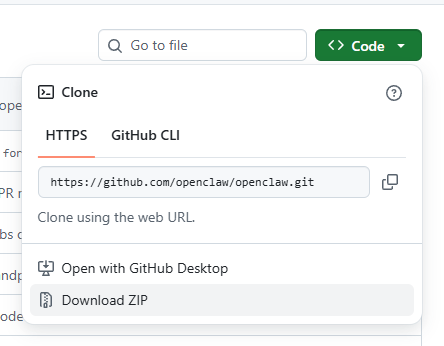
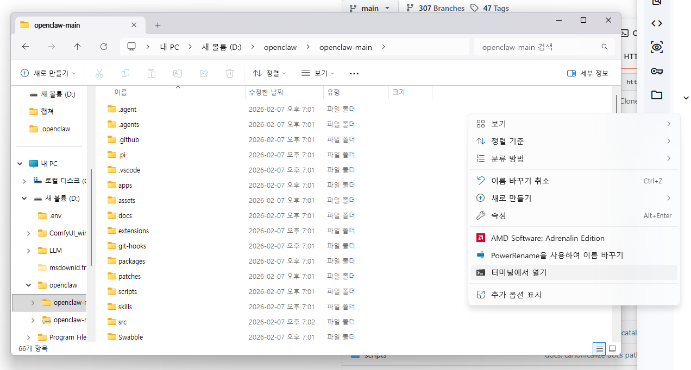
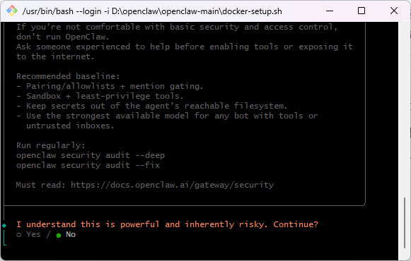
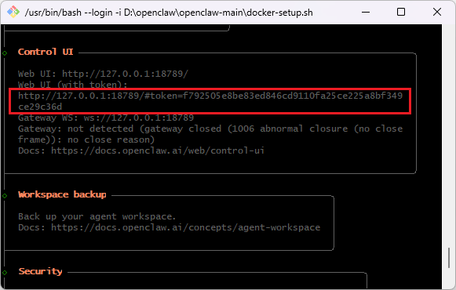
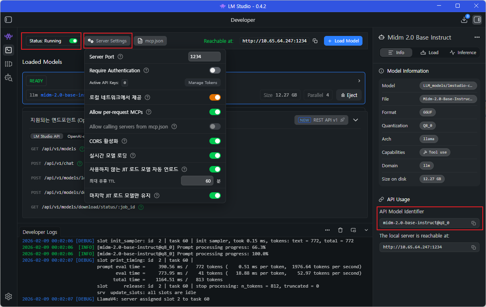
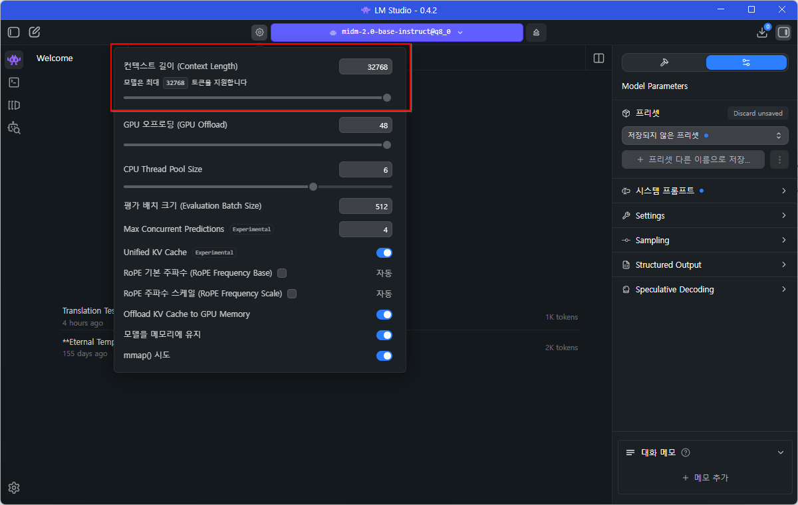

+++
title = "윈도우의 Docker에서 OpenClaw 설치 및 사용"
date = 2026-03-22T02:24:46+09:00
draft = false
categories = ["AI/OpenClaw"]
tags = ["ai", "OpenClaw", "Docker", "lm_studio"]
+++

## 1. 들어가며

&nbsp;&nbsp;해당 포스트는 docker에 OpneClaw를 설치하고 로컬 LLM과 연동하기 위해 LM Studio를 사용한 것을 기록해 둔 내용입니다. 참고하시더라도 개인의 PC 환경이 다를 수 있기 때문에 모두 같은 내용이 적용되지 못할 수도 있습니다. 저는 컴퓨터나 AI에 대해서는 그렇게 자세히 알지는 못합니다. 제가 초보자이다 보니 초보자의 관점에서 글을 쓸 수밖에 없었습니다. 대부분의 내용은 공식 문서를 참고하여 작성했습니다.

## 2. OpenClaw란 무엇인가?

&nbsp;&nbsp;[https://openclaw.ai/blog/introducing-openclaw](https://openclaw.ai/blog/introducing-openclaw)와 [https://github.com/openclaw/openclaw/blob/bf6ec64f/README.md#L1-L23](https://github.com/openclaw/openclaw/blob/bf6ec64f/README.md#L1-L23) 에 의하면, OpenClaw는 사용자의 컴퓨터에서 실행되고 이미 사용 중인 채팅 앱에서 작동하는 오픈 에이전트 플랫폼이며 사용자의 기기에서 실행되는 개인 AI 비서라고 한다.

## 3. OpenClaw 설치

&nbsp;&nbsp;만약 Docker가 아닌 일반적인 설치를 하고 싶다면 아래의 명령어를 사용하면 된다. 그러나 Docker에서 설치하고 싶다면 3.1. Docker 설치부터 참고/진행하면 된다.

&nbsp;&nbsp;[https://docs.openclaw.ai/install#after-install](https://docs.openclaw.ai/install#after-install)를 참고하여 OpenClaw를 설치한다. 윈도우11을 사용하는 상황이기에 ```Windows PowerShell```에서 아래의 명령어로 설치를 진행하면 된다. 그러나 이 방법은 간략하게 넘어갈 것이다. 나는 Docker에 설치할 것이기 때문이다.

```PowerShell
iwr -useb https://openclaw.ai/install.ps1 | iex
```

&nbsp;&nbsp;만약 OpneClaw를 삭제하고 싶다면 아래의 명령어를 실행하면 된다.

```PowerShell
openclaw uninstall
```

&nbsp;&nbsp;OpenClaw의 접근 권한은 상당히 넓다. 이것은 openclaw의 오류 혹은 자의적 판단으로 이용자가 본의 아니게 피해를 볼 수도 있음을 의미하지만, 그 넓은 권한이 있기 때문에 편한 부분도 있다. 개인의 선택에 따라서는 docker에 openclaw를 설치하는 것으로 다소의 불편함은 감수하고 안전성을 높이는 방향으로 사용할 수 있다.

### 3.1. Docker 설치

&nbsp;&nbsp;[https://docs.openclaw.ai/install/docker](https://docs.openclaw.ai/install/docker)에 의하면 Docker에 OpneClaw를 설치하기 위해서는 사전에 Docker Desktop(또는 Docker Engine)와 Docker Compose v2가 설치되어 있어야 한다는 것을 알 수 있다. Docker Desktop의 설치는 [https://docs.docker.com/desktop/setup/install/windows-install/](https://docs.docker.com/desktop/setup/install/windows-install/)를 참고하면 된다. ```Doker Desktop for Windows - x86_64```, ```Docker Desktop for Windows - x86_64 on the Microsoft Store```, ```Docker Desktop for Windows - Arm (Early Access)``` 옵션 중 2번째 설치 방식인 마이크로소프트 스토어로 설치했다.

&nbsp;&nbsp;일반적으로는 Docker Desktop을 설치하면 wsl과 Docker Compose v2가 자동으로 설치된다고 한다.

### 3.2. wsl 설치

&nbsp;&nbsp;Docker Desktop을 설치하면 wsl 2를 자동으로 설치된다. 잘 설치되었는지 확인해 보고 싶다면, 파워셸에서 아래의 명령어를 사용하면 된다.

```PowerShell
wsl.exe --list --verbose
```


&nbsp;&nbsp; 만약 설치되어있지 않다면, [https://learn.microsoft.com/ko-kr/windows/wsl/install](https://learn.microsoft.com/ko-kr/windows/wsl/install)를 참고하면 되며, 파워셸에서 아래의 명령어를 실행하면 설치가 진행된다. 기본적으로 wsl2 버전이 설치된다.

```PowerShell
wsl --install
```

&nbsp;&nbsp;기존에 wsl 1 버전을 사용하고 있었거나 혹은 오류 등의 원인으로 wsl1 버전이 설치되었다면 파웨셸에서 ```wsl --set-version Ubuntu 2```와 같은 구조의 명령어를 사용하면 wsl2 버전을 사용할 수 있다.

### 3.3. Docker에 OpenClaw 설치

#### 3.3.1. OpenClaw 다운로드



&nbsp;&nbsp;[https://github.com/openclaw/openclaw#](https://github.com/openclaw/openclaw#)에서 초록색 <>code 를 클릭하고, Download ZIP을 클릭해서 openclaw 파일을 다운로드한다.

#### 3.3.2. 압축해제 및 터미널(PowerShell) 실행



&nbsp;&nbsp;다운로드한 OpenClaw 파일의 위치는 각자가 관리하기 편한 위치로 이동시키면 된다. 나는 해당 파일을 ```D:\opneclaw\``` 에 이동시켰다. 이동시킨 파일의 압축을 풀고 폴더를 열고, '마우스 오른쪽 버튼 -> 터미널에서 열기'를 선택한다.

*최근에는 cmd는 사용되지 않는 추세인 것 같다. 굳이 '윈도우 시작'에서 오른쪽 버튼 '찾기'에서 'cmd'를 입력하지 않는 이상 '터미널에서 열기'를 하면 자동으로 'powershell'이 열린다.*

&nbsp;&nbsp;[https://docs.openclaw.ai/install/docker](https://docs.openclaw.ai/install/docker)를 참고하여 아래의 명령어를 실행한다.

```PowerShell
./docker-setup.sh
```

#### 3.3.3. 설치 및 옵션설정



&nbsp;&nbsp;파워셸(터미널)에서 ```./docker-setup.sh```를 실행하면 ```Building Docker image: openclaw: local```이 시작된다. 이 과정을 마치면 설치 및 사용에 대한 유의점의 안내와 함께 계속 여부를 묻는 내용이 나온다. 아래의 스크린샷이 그 내용이다. 해당 내용을 구글 번역기로 돌리면 내용은 다음과 같다.

> 기본 보안 및 접근 제어에 익숙하지 않다면 OpenClaw를 실행하지 마십시오. 도구를 활성화하거나 인터넷에 노출하기 전에 경험이 풍부한 전문가에게 도움을 요청하세요.</br></br>
> 권장 기본 설정:</br>
> - 페어링/허용 목록 + 멘션 게이팅</br>
> - 샌드박스 + 최소 권한 도구 사용</br>
> - 에이전트가 접근 가능한 파일 시스템에서 비밀 정보를 안전하게 보호</br>
> - 도구를 사용하거나 신뢰할 수 없는 받은 편지함을 사용하는 봇에는 가장 강력한 보안 모델을 적용 </br></br>
> 정기 실행: </br>
> openclaw security audit -- deep </br>
> openclaw security audit -- fix </br></br>
> 필독: https://docs.openclaw.ai/gateway/security

##### 3.3.3.1. I understand this is powerful and inherentl risk. Continue?

&nbsp;&nbsp;I understand this is powerful and inherentl risk. Continue? 는 **Yes**를 선택한다.

##### 3.3.3.2. Onboarding mode

&nbsp;&nbsp;Onboarding mode는 **QuickStart**를 선택했다.

##### 3.3.3.3. Model/auth provider

&nbsp;&nbsp;Model/auth provider는 **Skip for now**를 선택했다.

##### 3.3.3.4. Filter models by provider

&nbsp;&nbsp;Filter models by provider는 **All providers**를 선택했다.

##### 3.3.3.5. Default model

&nbsp;&nbsp;Default model은 가장 첫 번째 옵션인 Keep current (default: anthroic/claude-opus-4-6)를 선택했다.

&nbsp;&nbsp;**내 경우에는 Model/auth provider, Filter models by provider, Default model은 로컬 llm을 사용하기 위해 임의로 선택을 한 것이다. 필요에 따라서 각자가 원하는 ai 서비스를 선택하면 되며, 굳이 지금 당장 정하지 못하겠다면 자세한 설정은 스킵하거나 아무거나 선택해도 된다. 나중에 재설정 할 수 있다.**

##### 3.3.3.6. Select channel (Quickstart)

&nbsp;&nbsp;Select channel (QuickStart)에서는 **skip for now**를 선택했다.

&nbsp;&nbsp;각종 SNS 등을 살펴본 바로는 국내 사용자들은 보통 Telegram이나 Discode를 주로 사용하는 것 같다. 특히 텔레그램의 경우 설정하기 편하다는 것 같다. 이 부분도 추후 재설정을 할 수 있다.

##### 3.3.3.7. Configure skills now?



&nbsp;&nbsp;Configure skills now? (recommended)는 **No**를 선택했다. 각종 안내가 출력될 것이다. 그중에서 Control Ui를 찾는다. 해당 내용의 3번째 줄에 ```http://127.0.0.1:18789/#token=``` 으로 시작되는 부분이 있을 것이다. 이것을 복사해서 보관해 두고, 이 주소를 사용해서 OpenClaw에 접속할 수 있다. 만약 분실했다면 아래의 명령어로 다시 알아낼 수 있다.

```PowerShell
docker compose run --rm openclaw-cli dashboard --no-open
```

http://127.0.0.1:18789/#token=a80b25491ee8f0ac953ff18d3eb65259cc48964fadcec0c7

##### 3.3.3.8. Enable zsh shell completion for openclaw?

&nbsp;&nbsp;Enable zsh shell completion for openclaw?는 **No**를 선택했다. 이 기능은 터미널에서 openclaw 명령어 자동완성 기능의 사용 여부를 설정하는 것이다. 개발 편의성에 관련된 내용으로 필요성에 따라서 설정하면 된다고 한다.

&nbsp;&nbsp;이것으로 docker에 OpenClaw가 설치되었으며, docker desktop의 Containers나 Images를 확인해 보면 리스트가 추가되어 있을 것이다.

### 3.4. OpenClaw 접속

OpneClaw 접속은 **3.3.3.7. Configure skills now?**에서 복사해 둔 ```http://127.0.0.1:18789/#token=fxxxxxxxxxxxxxxxxxxxxxxxxxxxxxxxxxxxxxxxxxxxxxxx ```를 주소창에 입력해서 접속한다. 그런데 여기에서 '사이트에 연결할 수 없음'이라는 화면이 나왔다.

#### 3.4.1 설치 후 오류 해결

##### 3.4.1.1. OpenClaw 접속 오류

 &nbsp;&nbsp; Docker containers에서 openclaw가 실행 중인 것으로 나오지만 '사이트에 연결할 수 없음'이라는 메시지와 출력되며 OpenClaw에 접속할 수 없었다. 이 문제는 아래의 명령어를 파워셸에 차례대로 입력하는 것으로 해결할 수 있었다.

```PowerShell
docker-compose down
```
```PowerShell
docker-compose up -d
```

##### 3.4.1.2. disconnected (1008) : pairing required

&nbsp;&nbsp; '사이트에 연결할 수 없음' 문제를 해결하고 접속했더니 ```disconnected (1008): pairing required``` 오류가 발생했다. 해당 오류를 고치는 방법은 [https://www.reddit.com/r/clawdbot/comments/1qsguap/disconnected_1008_pairing_required/](https://www.reddit.com/r/clawdbot/comments/1qsguap/disconnected_1008_pairing_required/)에서 찾을 수 있었다. ```C:\Users\admin\.openclaw\devices.json```의 내용 중 ```"silent": false```를 ```"silent": true```로 변경하고 웹브라우저를 새로고침하면 된다.

*admin은 로컬 계정명이다.*

### 3.4. LM Studio

&nbsp;&nbsp;LM Studio를 로컬 서버로 사용하는 방법은 [https://lmstudio.ai/docs/developer/core/server](https://lmstudio.ai/docs/developer/core/server)를 참고하면 된다. 이것만으로는 어려움을 느껴 [https://www.youtube.com/watch?v=Bn_hkXCwO-U](https://www.youtube.com/watch?v=Bn_hkXCwO-U)도 추가로 참고하였다.





&nbsp;&nbsp;[https://docs.openclaw.ai/gateway/local-models#local-models](https://docs.openclaw.ai/gateway/local-models#local-models)를 참고하여 openclaw의 Settings의 Config의 Raw에서 json을 설정한다. 현재 사용하고 있는 llm 모델은 kt에서 만든 midm이라는 모델이기에 아래와 같은 모습의 json을 작성했다.

&nbsp;&nbsp;각자의 상황에 따라서 ```midm-2.0-base-instruct@q8_0```, ```"contextWindow": 32768```, ```"maxTokens": 4096```, ```"token": "xxxxxxxxxxxxxxxxxxxxxxxxxxxxxxxxxxxxxxxxxxxxxxxx"``` 라고 작성되어 있는 부분을 변경하고 사용하면 된다.

&nbsp;&nbsp;컨텍스트 길이(Context Length)는 LM Studio의 chat 화면에서 톱니바퀴를 클릭하면 확인할 수 있다. 컨텍스트 길이는 JSON 파일 내 contextWindow와 동일하게 설정해야 한다. 또한, LM Studio를 재실행하면 초기화된다. 그렇기에 재실행을 하면 매번 재설정해야 한다. 내 경우 llm 모델의 크기는 타협하고 컨텍스트 길이를 최댓값으로 해뒀지만, llm 크기와 PC 사양 등을 고려해서 적절하게 조정하는 것이 좋다고 한다.

```JSON5
{
  "agents": {
    "defaults": {
      "model": {
        "primary": "lmstudio/midm-2.0-base-instruct@q8_0"
      },
      "models": {
        "lmstudio/midm-2.0-base-instruct@q8_0": {}
      }
    }
  },
  "models": {
    "mode": "merge",
    "providers": {
      "lmstudio": {
        "baseUrl": "http://host.docker.internal:1234/v1",
        "apiKey": "lmstudio",
        "api": "openai-responses",
        "models": [
          {
            "id": "midm-2.0-base-instruct@q8_0",
            "name": "midm-2.0-base-instruct@q8_0",
            "reasoning": false,
            "input": ["text"],
            "cost": {
              "input": 0,
              "output": 0,
              "cacheRead": 0,
              "cacheWrite": 0
            },
            "contextWindow": 32768,
            "maxTokens": 4096
          }
        ]
      }
    }
  },
  "commands": {
    "native": "auto",
    "nativeSkills": "auto"
  },
  "gateway": {
    "port": 18789,
    "mode": "local",
    "bind": "loopback",
    "auth": {
      "mode": "token",
      "token": "xxxxxxxxxxxxxxxxxxxxxxxxxxxxxxxxxxxxxxxxxxxxxxxx"
    },
    "tailscale": {
      "mode": "off",
      "resetOnExit": false
    }
  },
  "wizard": {
    "lastRunAt": "2026-02-07T15:11:22.524Z",
    "lastRunVersion": "2026.2.6-3",
    "lastRunCommand": "onboard",
    "lastRunMode": "local"
  },
  "meta": {
    "lastTouchedVersion": "2026.2.6-3",
    "lastTouchedAt": "2026-02-07T15:11:22.528Z"
  }
}
```

## 4. 마치며

&nbsp;&nbsp; 지금까지 docker desktop(wsl2, docker compose v2), Open Claw 설치 및 설정과 LM Studio 연동하는 방법을 기록해 두었다. 기록이라 명명한 이유는 나의 목적(무료로 open claw를 한번 가동해 보는 것)에 부합한 방식 그리고 그것을 실제로 해보며, 내가 겪은 어려움을 기록했기 때문이다. 현재 ai의 도움을 받아서 윈도우 환경에서 docker에 OpenClaw를 설치하기에는 어려운 부분이 있다. 아무래도 인터넷에 정보가 별로 없어서(=ai가 학습할 자료가 적어서) 그러한 것으로 추측된다.

&nbsp;&nbsp;추후에 가능하다면 미처 못다 한 설정을 마저 마무리하는 글을 쓰도록 최대한 노력해보겠다.
